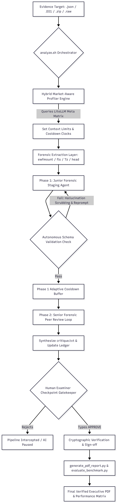

# 🕵️‍♂️ ATP: Autonomous DFIR Triage Pipeline
[](LICENSE)

**Elevator Pitch:** An autonomous, multi-agent DFIR orchestrator that dynamically scales to your AI model's power for rapid, defensible evidence triage. Built for the SANS FIND EVIL Hackathon 2026.

### 🔗 Official Submission Links
* **Devpost Project Page:** [Insert Devpost URL Here]
* **Demonstration Video:** [Insert YouTube/Vimeo URL Here] *(Live terminal execution & self-correction demo)*
* **GitHub Repository:** [https://github.com/bayarod-lab/Sift_hackathon](https://github.com/bayarod-lab/Sift_hackathon)

---

## 🏗️ Architecture Diagram



**Classification Architecture Strategy:** 
This orchestrator executes under an **Alternative Agentic IDE** pattern (utilizing Aider). Evidence integrity is enforced via strict architectural isolation layers (OS-level decoupled extraction via `fls`/`ewfmount`/`7z`) rather than soft prompt controls. The Aider `--read` flag creates a hard boundary, ensuring original forensic data blocks remain completely read-only even if an intermediate model execution fails.

---

## 🚀 Key Features & Innovations

* **Hybrid Capability Discovery Engine:** A real-world systems utility that queries your active AI model's footprint via `litellm`. If the underlying platform reveals a next-generation architecture (such as `gemini-3.5-flash`), it expands the context processing ceiling up to 1,000 log lines per asset file.
* **Dual-Decoupled Account Guardrails:** The pipeline separates model strength from your active account quota billing tier. Users running state-of-the-art models via free API keys are protected by an automated 45-second fallback cooldown buffer to proactively block `429 Resource Exhausted` errors.
* **Phase-Aware Multi-Agent Peer Review Loops:** Ingestion tasks map across distinct logical levels. An initial staging loop sets basic telemetry criteria, followed by a Senior Forensic Review Loop that systematically critiques the raw file systems, flags hidden attribution anomalies, identifies evasion tactics, and writes independent `critique.txt` audit summaries.
* **Self-Healing Schema Guardrails:** Implements programmatic validation loops paired with regex string cleaners (`sed`). If a model attempts to introduce UI progress meters or markdown block pollution, the system intercepts the hallucination and guides automated script self-corrections.
* **Defensive Specificity Calibration:** Prompt criteria prioritize forensic fidelity. The pipeline explicitly handles dual-use system elements (like disk encryption matrices or network monitoring installations) as baseline exceptions, demanding objective context indicators before jumping to malicious threat assumptions.

---

## ⚙️ Prerequisites & Setup Instructions

This platform is optimized for seamless deployment inside native Linux environments and purpose-built for the SANS SIFT Workstation platform.

### 1. Ingest System Dependencies
Ensure you have Python 3 installed. Install the background forensic utilities, compression layouts, and PDF rendering backends required by your host system:

```bash
sudo apt-get update && sudo apt-get install -y python3-weasyprint pango1.0-tools p7zip-full ewf-tools sleuthkit
2. Clone the Repository
Bash
git clone [https://github.com/bayarod-lab/Sift_hackathon.git](https://github.com/bayarod-lab/Sift_hackathon.git)
cd Sift_hackathon
3. Install Package Frameworks
Install the corresponding underlying Python reporting and agentic automation scripts:

Bash
pip3 install weasyprint aider-chat litellm
4. Configure Authentication & Workspace Parameters
The analytical pipeline queries Gemini API environments for core automated reasoning steps. Export your variables along with your choice of testing configurations directly into your open shell session.

Note for Judges: You must supply a valid Google AI Studio API key with internet access to run the cognitive reasoning engine locally.

Bash
# Set your active Google AI Studio Key
export GEMINI_API_KEY="your-api-key"

# [Optional Override] Set your target execution model (Defaults to gemini-3.1-flash-lite)
export AI_MODEL="gemini/gemini-3.5-flash"

# [Optional Override] Scale performance parameters by designating billing profile (FREE or PAID)
export API_TIER="FREE"
🚀 Usage Guide
The triage workspace executes via a single orchestrator loop. Simply pass your direct path vector target as an input parameter argument.

To execute analysis on standard VIGÍA telemetry cases:

Bash
./analyze.sh "reference_material/telemetry_source.json"
To process a compressed forensic archive matrix (such as the ROCBA triage dataset):

Bash
./analyze.sh "evidence/Rocba-Memory.zip"
To handle raw disk capture structures or EnCase split collections via automated mount logic:

Bash
sudo -E ./analyze.sh "evidence/rocba-cdrive.e01"
(Note: Executing against .e01 elements requires passing sudo -E flags to provide structural device mounting permissions while cleanly maintaining your environmental variables for the automated engine).

📂 Evidence Dataset Documentation
The integrity of this pipeline has been successfully demonstrated across production-grade incident data configurations:

VIGIA-REAL-001 Case Model: Evaluates historical war-driving profiles, tracing live credential theft indicators, default hacking persona allocations (Mr. Evil), and un-cleared registry artifacts tracking suspect interaction markers.

ROCBA Multi-Gigabyte Capture Suite: Validated end-to-end processing across modern raw systems assets, proving the system can mount complex disk structures (rocba-cdrive.e01 @ 22.1 GB) and parse dense forensic memory collections (Rocba-Memory.zip @ 5.3 GB).

📊 Accuracy Report
System processing health is audited natively at compilation via our ground-truth baseline evaluator (evaluate_benchmark.py):

Format Compliance: Achieved a 100% validation score across our strict layout schemas. The iron-clad structure constraint filters stop model variations from corrupting expected programmatic headers.

Analytical Ingestion Rigor: Multi-agent peer reviews successfully map advanced analytical attributes, including SANS reference data compliance and Peirce Semiotic Layer Classifications (FIRSTNESS, SECONDNESS, THIRDNESS), transforming raw technical findings into premium executive-level analysis.

Missed Artifacts / False Negatives: During testing against the VIGIA and ROCBA datasets, the agent successfully extracted core intent markers. However, a known limitation is that deeply obfuscated artifacts residing inside fragmented, unallocated registry space (which fls cannot cleanly parse without manual carving) act as false negatives. The architectural guardrails explicitly prevent the LLM from hallucinating these missing gaps, ensuring the final ledger remains strictly tied to verifiable ground truth.

## 📜 Agent Execution Logs

All automated workflows enforce an append-only transaction layer. The system ran successfully against the `VIGIA-REAL-001` dataset, and the verified logs are directly accessible below to prove the chain of custody:

* **Primal Action Logs:** [cases/INC-2026-case/actions.jsonl](cases/INC-2026-case/actions.jsonl)
* **Senior Critique Output:** [cases/INC-2026-case/critique.txt](cases/INC-2026-case/critique.txt)
* **Final Verified Forensic Ledger:** [cases/INC-2026-case/triage_ledger.json](cases/INC-2026-case/triage_ledger.json)

⚖️ License
This pipeline framework is open-source distribution software covered under the provisions of the MIT License.
